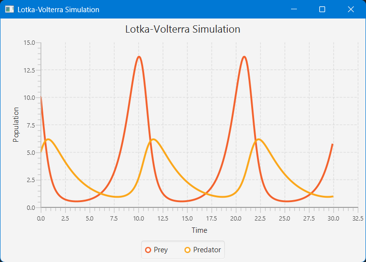
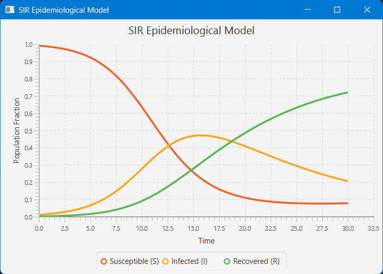

# sim-plot-ode

A simple Java project for **Dynamic Systems Modelling**, simulation, and plotting of Ordinary Differential Equation (ODE) systems using custom solvers and JavaFX visualization.

---

## ✨ Features

- Define custom ODE systems easily
- Simulate them using the RK4 solver (Runge–Kutta 4th Order)
- Visualize time-series trajectories using JavaFX Line Charts
- Includes built-in systems like:
  - FitzHugh-Nagumo neuron model
  - SIR epidemiological model

---

## 📦 Artifact Info

| Key         | Value                  |
|-------------|------------------------|
| Group ID    | `io.github.rajveer`    |
| Artifact ID | `sim-plot-ode`         |
| Version     | `0.1.0`                |

> Note: Not published on Maven Central — clone and build locally.

---

## 🛠️ Getting Started

### Requirements

- Java 17+ (JavaFX requires modern JDK)
- JavaFX SDK installed or available to your build tool
- Optional: Maven or Gradle for building

### Clone the repo

```bash
git clone https://github.com/muichi-mon/sim-plot-ode.git
cd sim-plot-ode
```

---

## 📈 Example Output

### Lotka-Volterra Simulation


### SIR Epidemiological Model

