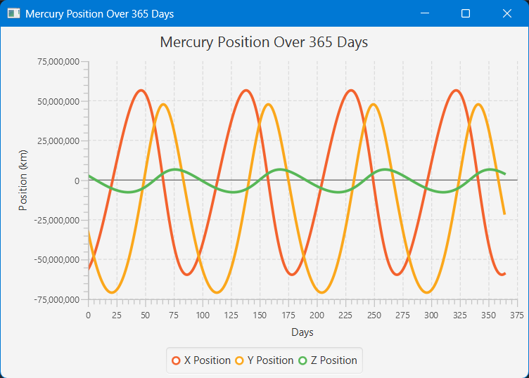

# sim-plot-ode

A simple Java project for **Dynamic Systems Modelling**, simulation, and plotting of Ordinary Differential Equation (ODE) systems using custom solvers and JavaFX visualization.

---

## ✨ Features

- Define custom ODE systems easily
- Simulate them using multiple solvers, including Euler and RK4 (Runge–Kutta 4th Order)
- Visualize time-series trajectories using JavaFX GUI application
- Includes built-in systems like:
    - Solar System Model (N-Body Simulation)
    - FitzHugh-Nagumo neuron model
    - SIR epidemiological model

---

## 📦 Artifact Info

| Key         | Value               |
|-------------|---------------------|
| Group ID    | `io.github.rajveer` |
| Artifact ID | `sim-plot-ode`      |
| Version     | `1.0.0`             |

> Note: Not published on Maven Central — clone and build locally.

---

---

## 🚀 Getting Started

### 🧰 Prerequisites

- **Java 22** (or compatible with your JavaFX version)
- **Maven** installed (`mvn -v` to check)
- JavaFX SDK is automatically handled via Maven dependencies

---

### 🔧 Build and Run

Clone the repository and run the JavaFX application:

```bash
git clone https://github.com/your-username/sim-plot-ode.git
cd sim-plot-ode
mvn clean javafx:run
```

---

## 📈 Example Output

### Lotka-Volterra Simulation


### Solar System Model


---

## 🧪 Getting Started with the GUI

You can simulate and visualize your own ODE systems directly in the built-in JavaFX GUI. Here's a step-by-step example using the **Lotka–Volterra predator-prey model**:

We want to solve the following ODE system:

### ✅ Step-by-Step Instructions

#### 🔹 Step 1: Add the First Equation (Prey)
- Enter the expression: `1.5*y0 - y0*y1`
- Set `y₀` to `10`
- Click ➕ **Add**

#### 🔹 Step 2: Add the Second Equation (Predator)
- Enter the expression: `y0*y1 - 3.0*y1`
- Set `y₀` to `5`
- Click ➕ **Add**

#### 🔹 Step 3: Set Time Parameters
| Field   | Value   |
|---------|---------|
| `t₀`    | `0`     |
| `dt`    | `0.01`  |
| `tEnd`  | `20`    |

#### 🔹 Step 4: Select Solver
- Choose **RK4 Solver** from the dropdown

#### 🔹 Step 5: Solve
- Click ✅ **Solve**

---